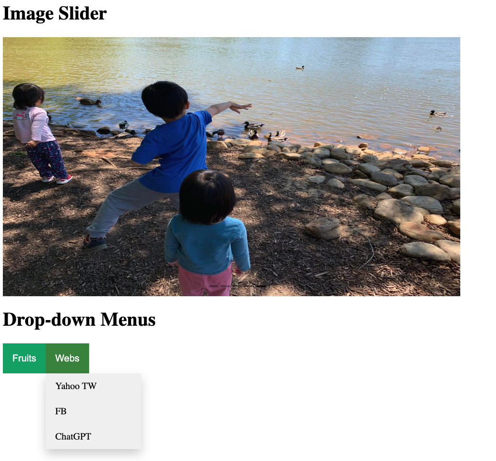

# Dynamic User Interface Interactions

This small project builds reusable drop-down menus and a simple image carousel.

## Table of Contents

- Demo
- Technologies Used
- Features
- Credits

## Demo

Check out the [**live**](https://elsiechen.github.io/DynamicUI/) demo.

## Technologies Used

- HTML
- CSS
- JavaScript

## Features

- Write reusable drop-down function without repeating the JavaScript code.
- Previous and next buttons to advance the image forward or backward
- Click-able navigation bars at the bottom of carousel, indicating which slide you are on
- Smooth transitions when changing images
- Set interval to advances the slides every 5 seconds

## Credits

- The Odin Project: [Dynamic User Interface Interactions](https://www.theodinproject.com/lessons/node-path-javascript-dynamic-user-interface-interactions#image-slider)
